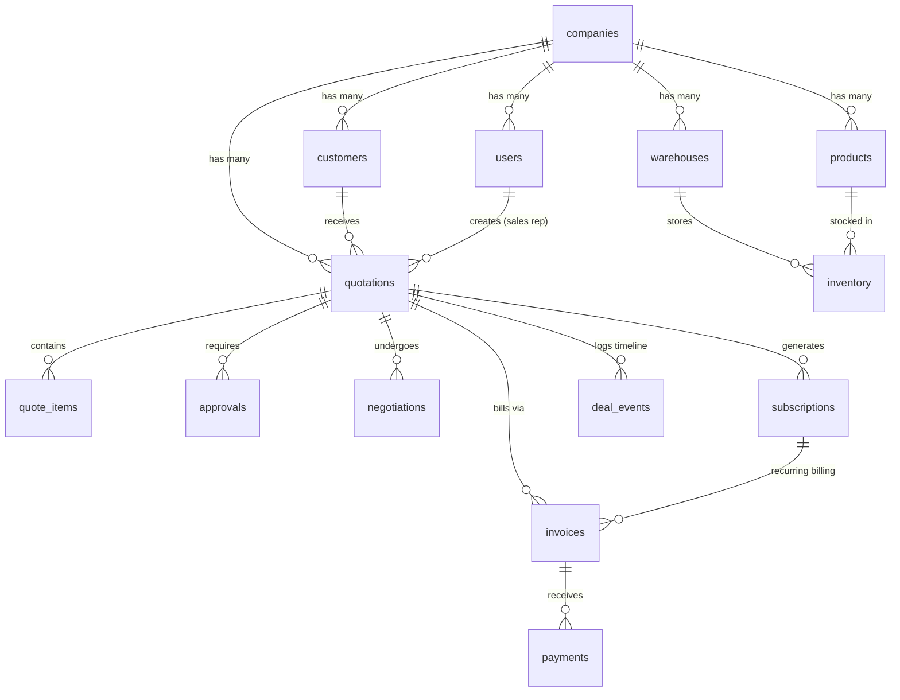

# DealFlow360 — Database Architecture & Schema Documentation

The `dealflow360` database is a normalized PostgreSQL database designed for an enterprise B2B deal desk, quotation governance, subscription billing, and fulfillment management engine.

---

## 🚀 Execution & Quick Start

To execute `schema.sql` on a fresh PostgreSQL instance:

```bash
# 1. Create the database
createdb -U postgres dealflow360

# 2. Run the schema script
psql -U postgres -d dealflow360 -f database/schema.sql
```

---

## 📊 Overview of 15 Core Tables

The schema is built around **15 core domain tables** with strictly typed UUID primary keys, foreign key constraints, checks, and performance indexes.

| # | Table Name | Purpose | Key Relationships |
|---|------------|---------|-------------------|
| **1** | `companies` | Multi-tenant organization boundaries | Parent of users, customers, products, warehouses, quotations |
| **2** | `users` | Application accounts (`ADMIN`, `SALES_REP`, `SALES_MANAGER`, `FINANCE`). Stores `password_hash`. | Belongs to `company` |
| **3** | `customers` | Client records categorized by tier (`BRONZE`, `SILVER`, `GOLD`) | Belongs to `company` |
| **4** | `products` | Catalog items with default pricing, costs, tax rates, and subscription flags | Belongs to `company` |
| **5** | `discount_rules` | Governance policies defining max allowed discount % by tier and optional category | Belongs to `company` |
| **6** | `warehouses` | Physical storage facilities with base shipping costs | Belongs to `company` |
| **7** | `inventory` | Stock availability per warehouse (`quantity` & `reserved_quantity`) | Links `warehouse` and `product` |
| **8** | `quotations` | Commercial proposal headers storing financial totals, margins, and risk scores (0-100) | Links `company`, `customer`, and `sales_rep` user |
| **9** | `quote_items` | Quote line items preserving **historical snapshots** of price, cost, and discount | Belongs to `quotation`, optionally references `product` |
| **10** | `approvals` | Approval decision workflow records for `SALES_MANAGER` and `FINANCE` | Belongs to `quotation`, references `approver` user |
| **11** | `negotiations` | Customer portal negotiation history rounds | Belongs to `quotation`, optionally references `quote_item` |
| **12** | `subscriptions` | Recurring billing agreements (`MONTHLY`, `QUARTERLY`, `YEARLY`) | Belongs to `quotation`, `customer`, and `product` |
| **13** | `invoices` | Financial billing documents (`ONE_TIME` or `RECURRING`) | Belongs to `quotation`, `customer`, optional `subscription` |
| **14** | `payments` | Monetary collection transactions (`CARD`, `BANK_TRANSFER`, `UPI`, `CASH`) | Belongs to `invoice` |
| **15** | `deal_events` | Audit log timeline for quotation lifecycle changes | Belongs to `quotation`, optionally references `actor` user |

---

## 🔗 Key Entity Relationships



---

## 🛡️ Critical Design Principles

### 1. Historical Snapshot Integrity (`quote_items`)
Products may undergo price or tax rate changes over time. To ensure commercial quotations remain immutable after creation, `quote_items` stores historical snapshots of:
- `product_name`, `category`, `unit_price`, `unit_cost`, `tax_rate`
- `quantity`, `discount_percent`, `line_subtotal`, `discount_amount`, `tax_amount`, `line_total`

### 2. Calculated Available Stock (`inventory`)
Available stock is calculated dynamically:
$$\text{Available Stock} = \text{quantity} - \text{reserved\_quantity}$$
A CHECK constraint enforces that `reserved_quantity <= quantity`.

### 3. Password Security (`users`)
Plaintext passwords are strictly forbidden. The `password_hash` column stores secure hashes (bcrypt/argon2) generated by application security services.

### 4. Monetary Integrity
All currency amounts use exact fixed-point `NUMERIC(14, 2)` or `NUMERIC(12, 2)` types with CHECK constraints enforcing non-negative values.

---

## ⚡ Indexing Strategy

Indexes are created for high-frequency join and lookup patterns:
- **`users(email)`**: Fast authentication lookup
- **`quotations(quote_number)`**: Unique quote code search
- **`invoices(invoice_number)`**: Unique invoice code search
- **`products(sku)`**: Fast product search
- **`company_id`**: Multi-tenant data filtering across all entity tables
- **`quotations(status)` & `quotations(created_at)`**: Fast dashboard pipeline and reporting queries
